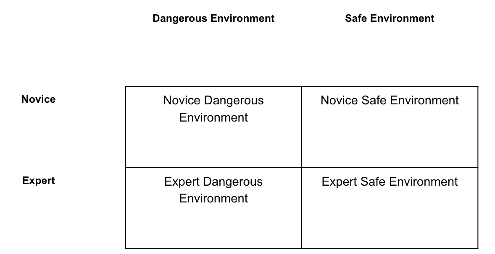
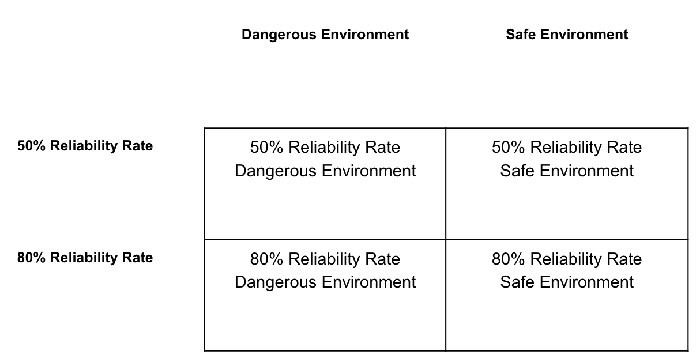

# Research Practicum 2018 – Research Plan

> * Group Name: Mr. Robot
> * Group participants names: Blake Nguyen and Na'Kiya Russell
> * Project Title: Project Title: Human Robot Interaction (HRI): Trust in Diagnostic Aiding Automation

## Purpose Statement
The purpose of this study is to explore the reliability threshold and its effect on human-robot teams in dangerous and safe environments. The study also seeks to compare at what level of expertise: novice or expert, relies more on diagnostic aiding technology (i.e., autonomous agent, automation) in such environments.

## General Introduction

In human robot teams, there has been an increase in the use of automation being used to help teams operate tasks effectively. There any many environments where teams may have the information they need or a disruption of unexpected events occurs where unforeseen events takes place; in either situation it is best to be prepared. One factor we wanted to research is trust in diagnostic aiding automation (robots). There is a type of automation called diagnostic aiding, which involves information acquisition and analysis. When diagnostic aiding falls below 70% reliability, it is seen as not useful, and will negatively affect overall task performance. Along with a diagnostic aid, a reliability threshold was developed to measure tasks humans are capable of performing without needing help from such technologies. Furthermore, it is stated that regardless of the reliability threshold, humans will still rely on diagnostic aiding automation in dangerous environments. In benign (safe) environmental conditions, the reliability level isn’t as high but it is still noted to be prominent. There is a respective interest in further investigating whether the level of expertise or background knowledge can play a factor in how or when humans decide to rely on diagnostic aiding automation.

The problem that we are tackling is identity in what combinations of the environments (benign or dangerous), reliability threshold (80% or 50%), and level of expertise (novice or expert) will a human rely on a diagnostic aid to help guide their situational awareness when they are unable too.

(Motivation. Why is this problem interesting and relevant to the research community?)

This is an interesting problem because we can understand in what environments, at what level of reliability threshold, and expertise level do humans tend to rely on technology. This can potentially benefit future research by identifying at what level of reliability does technology need to developed at (or near) to make each group (novice or expert) successful in their own right no matter the environment.

(Proposed Solution. How do we propose to tackle this problem (that has been identified in the previous paragraphs, is interesting to the community, and has yet to be tackled by other researchers)?)

We propose to tackle the problem by conduct the research/experiment on novice and experts in benign and dangerous environments with a reliability threshold of 80% and 50%??

(Contributions. An enumeration of the contributions of the senior design project)

(This project makes the following contributions:)(you must have this!!)
•	(Contribution 1)
•	(Contribution 2)

## Related Work

Discuss briefly about published matter that technically relates to your proposed work in 4-5 paragraphs.

## Research Questions
* Is there a difference in perception of reliable and unreliable diagnostic aiding automation in both safe and dangerous environments when comparing levels of expertise (novice and experts)? 
* Do novice consider diagnostic aiding automation to be reliable or unreliable as opposed to an expert operator when automation reliability rate is set to 50% in both benign and hostile environments?

## Research Methods

### Study Design

## Hypotheses
1) Novice will consider diagnostic aiding automation to be unreliable when reliability is set at 50% in both safe and dangerous environments.
2) Experts will consider diagnostic aiding automation to be reliable only in hostile environments when reliability is set at 50%.
3) Experts will consider diagnostic aiding automation to be unreliable when reliability is set to 50% in safe environments.

## Preliminary Framework/Setup

### Previous Research

## Plan of Attack for Deliverables
* Determine our definition of novice and experts based on literature review.
* Develop questionnaire to assess whether levels of expertise find automation reliable or unreliable. Paper form or Qualtrics online survey engine?
* Determine how to administer questionnaire to participants
* Analyze data collected from Pilot Study
* Complete Github readme files
* Develop draft UCF IRB protocol for our research study

## References

* Burke, J. L., Murphy, R. R., Coovert, M. D., & Riddle, D. L. (2004). Moonlight in Miami: Field study of human-robot interaction in the context of an urban search and rescue disaster response training exercise. Human–Computer Interaction, 19(1-2), 85-116.
* Chadwick, R. A. (2008). Considerations for use of aerial views in remote unmanned ground vehicle operations. Proceedings of the Human Factors and Ergonomics Society Annual Meeting, 52, 252–256.
* Dixon, S. R., & Wickens, C. D. (2006). Automation reliability in unmanned aerial vehicle control: A reliance-compliance model of automation dependence in high workload. Human Factors, 48(3), 474-486.
* Endsley, M. R. (1995). Toward a theory of situation awareness in dynamic systems. Human Factors, 37(1), 32-64.
* Endsley, M. R. (1996). Automation and situation awareness. In R. Parasuraman & M. Mouloua (Eds.), Automation and human performance: Theory and applications, (pp. 163-181). Mahwah, NJ: Lawrence Erlbaum.Green, D. M., & Swets, J. A. (1988). Signal Detection Theory and Psychophysics. Los Altos, CA: Peninsula Publishing.
* Groom, V., & Nass, C. (2007). Can robots be teammates?: Benchmarks in human–robot teams. Interaction Studies, 8(3), 483-500.
* Horrey, W. J., Wickens, C. D., Strauss, R., Kirlik, A., & Stewart, T. R. (2009). Supporting situation assessment through attention guidance and diagnostic aiding: The benefits and costs of display enhancement on judgment skill. In A. Kirlik (Ed.), Adaptive perspectives on human- technology interaction: Methods and models for cognitive engineering and human-computer interaction (pp. 55-70). Oxford University Press.
* Madhavan, P., Wiegmann, D. A., & Lacson, F. C. (2006). Automation failures on tasks easily performed by operators undermine trust in automated aids. Human Factors, 48(2), 241-256.
* Maltz, M., & Shinar, D. (2003). New alternative methods of analyzing human behavior in cued target acquisition. Human Factors, 45(2), 281-295.
* Parasuraman, R., Sheridan, T. B., & Wickens, C. D. (2000). A model for types and levels of human interaction with automation. IEEE Transactions on systems, man, and cybernetics-Part A: Systems and Humans, 30(3), 286-297.
* Parasuraman, R., & Wickens, C.D. (2008). Humans: Still vital after all these years of automation. Human Factors, 50(3), 511-520.
* Schuster, D., Jentsch, F., Fincannon, T., & Ososky, S. (2013). The impact of type and level of automation on situation awareness and performance in human-robot interaction. In D. Harris (Ed.), Lecture Notes in Computer Science: Vol. 8019. Engineering Psychology and Cognitive Ergonomics, (pp. 252-260).
* St. John, M., & Manes, D. I. (2002). Making unreliable automation useful.
Proceedings of the Human Factors and Ergonomics Society Annual
Meeting, 46, 332-336.
* Wickens, C. D., & Dixon, S. R. (2007). The benefits of imperfect diagnostic
automation: A synthesis of the literature. Theoretical Issues in
Ergonomics Science, 8(3), 201-212.

