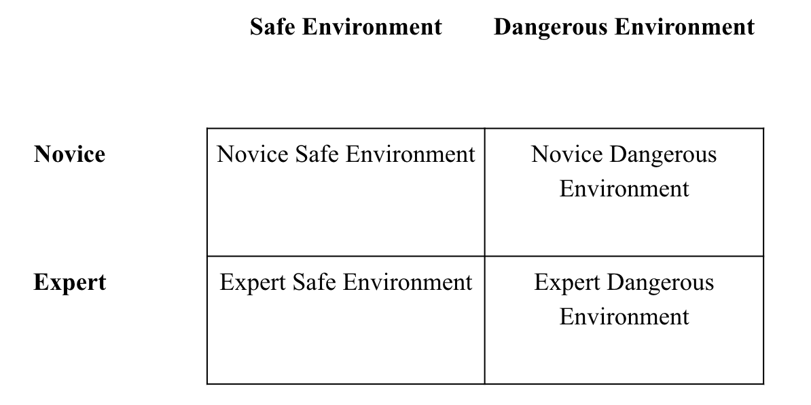
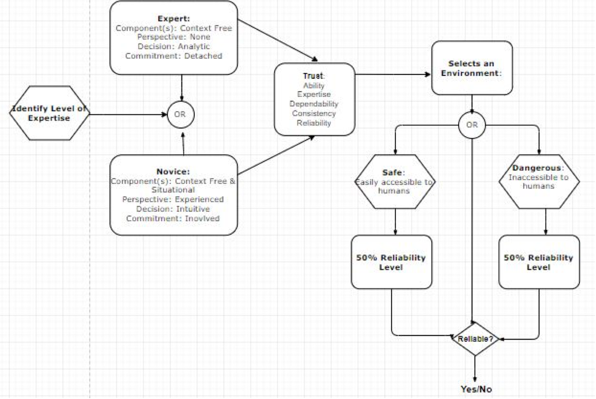

# Research Practicum 2018 – Research Plan

> * Group Name: Mr. Robot
> * Group participants names: Blake Nguyen and Na'Kiya Russell
> * Project Title: Project Title: Human Robot Interaction (HRI): Trust and Reliance in Diagnostic Aiding Automation

## Purpose Statement
The purpose of this study is to explore the reliability threshold and its effect on human-robot teams in dangerous and safe environments. The study also seeks to compare at what level of expertise: novice or expert, relies more on diagnostic aiding technology (i.e., autonomous agent, automation) in such environments.

#### Motivation: Why is this problem interesting and relevant to the research community?

This is an interesting problem because we can understand in what environments, at what level of reliability threshold, and expertise level do humans tend to rely on technology. This can potentially benefit future research by identifying at what level of reliability does technology need to developed at (or near) to make each group (novice or experts) successful in their own right no matter the environment.

#### Proposed Solution: How do we propose to tackle this problem (that has been identified in the previous paragraphs, is interesting to the community, and has yet to be tackled by other researchers?)

In order to further investigate this area of research, we propose conducting a research experiment, specifically, a small pilot study to test some of our variables. In an effort to measure trust and reliance, we will look at the level of expertise, specifically, novice and experts to determine in what environmental conditions will they likely or less likely use diagnostic aiding automation when reliability rate is set to 50%.

#### Contributions
*	We believe our project will contribute to further advancing research regarding human-robot interaction (HRI).
*	We believe our project will contribute to the area of research that is interested in reliability in automation across human-robot teams.
*	We believe our project will provide a better understanding of reliability and willingness to work with automation at various levels of expertise.

## General Introduction

In human robot teams, there has been an increase in the use of automation being used to help teams operate tasks effectively. There any many environments where teams may have the information they need or a disruption of unexpected events occurs where unforeseen events takes place; in either situation it is best to be prepared. One factor we wanted to research is trust in diagnostic aiding automation (robots). There is a type of automation called diagnostic aiding, which involves information acquisition and analysis. When diagnostic aiding falls below 70% reliability, it is seen as not useful, and will negatively affect overall task performance.
Along with a diagnostic aid, the reliability threshold was formed to measure tasks humans are capable of performing without needing help from such technologies. Furthermore, it is stated that regardless of the reliability threshold, humans will still rely on diagnostic aiding automation in dangerous environments. However, in benign (safe) environmental conditions, the reliability level isn’t as high but it is still noted to be prominent. There is a respective interest in further investigating this area of research as to whether the level of expertise or background knowledge can play a factor in how or when humans decide to trust and rely on diagnostic aiding automation.

Investigating the level of expertise for this research allows for us to gain a better understanding of the background knowledge of the user/participant. We realized that incorporating a user’s of expertise, or prior knowledge that one may have about a particular situation can gives us insight to why (given the environment) a user may rely or trust the automation more or less. For example, it is hypothesized that participants who are novice may trust or reliable on the automation more regardless of the environment (dangerous or safe). However, for experts they may be very knowledge about the automation and may not trust it as much as a novice but would reliable on the automation in dangerous situations.

Defining what classifies a user as a novice or expert was research by previous studies where skills such as problem solving on your own, the need for direction or context, and decision making was taken into account. Additionally, trust was defined by considering what factors affect trust; rather it be environmental factors, team dynamics, training/knowledge level, and so forth. Aside from viewing factors that affects trust, it is also important to recognize that in certain relationship trust is viewed in the same manner as others.These relationships include: human-human, human-robot, and  human-automation.

## Related Work

Discuss briefly about published matter that technically relates to your proposed work in 4-5 paragraphs.

##### Literature Review
###### The Human-Automation Relationship.
As tasks become more difficult for people to undertake, automation proves to be a promising alternative to decrease physical and mental workload. For the most part, automation take most complicated tasks and simplify them to aid human labor, or replace human labor altogether. People are prone to errors; automation significantly decreases human-made errors and increase efficiency. However, complete reliability is rarely achieved, and trust dwindles as reliability decreases. Nonetheless, there have been huge strides with every newer technology being developed; for example, researchers of different disciplines use automation to discover new marine or extraterrestrial life forms. Complex surgical procedures are possible with the use of automations. In spite of technical inaccuracy or other types of error during human-automation interaction, automations have progressed a plethora of technological advancements to human-robot teams.

###### Automation Errors.
The human-automation relationship contain many variables that could affect the overall performance of a set task. Dixon, Wickens, & McCarley (2007) wanted to make a clear distinction between the effects that false alarms and misses have on operators’ trust in automation. They focused on two types of automation errors: false alarms and misses. They had their participants undertake two tasks that involved aid of an automation: a tracking task and a monitoring task. Among the hypotheses of Dixon et al. (2007), believed that false alarms would harm performance by decreasing compliance and reliance. False alarms would decrease compliance by having operators distrust and ignore some of the alerts. According to the results, operators shifted their attention away from the tracking task (thereby reducing that task performance), and monitor the system’s gauge (Dixon, Wickens, & McCarley, 2007).

Dixon et al. also concluded that misses had no significant effect on compliance. It was thought that compliance and reliance were two independent constructs that can be reduced by two different automation errors. False alarms would affect only compliance. Misses would only affect reliance (Dixon, Wickens, & McCarley, 2007). However, Dixon et al. (2007), Stephen Rice (2008) provided evidence that  false alarms and misses can decrease the magnitude of both constructs, with one to a lesser degree. Rice (2008) used multiple automation aids in his study to further understand those constructs as previous models of their relationship did not seem sufficient enough.

###### Signal Detection Theory.
Wickens and Colcombe (2007) also experimented with the two constructs with a similar method, however, he offered a different outlook on the relationship between the two. Within the scope of signal detection theory, human-automation interaction is affected by the automation’s reliability (discriminate between non event and event) and response bias (alert and silence). In this case, Rice was focusing on the automation’s contribution in the dual tasking, and how it affects overall performance. His study supported previous claims of false alarms and misses being detrimental to task performance by lowering reliance and compliance. He explained that while both errors occurs, operators would have to divert their attention to a different task in order to double check their automation aid. This process takes time way from their assigned task and, therefore, reduce efficiency (Wickens and Colcombe, 2007). Participants interestingly continued to depend on their automation aids despite the lowered reliability. As for the automation’s response bias, results showed evidence of auditory alerts being useful for two different concurrent tasks. They’re not easy to ignore, and they require a different perceptual modality. However, different types of alerts in a false alarmed prone setting, degraded performance significantly.

###### Reliability Disclosure.
According to Wang et al. (2009), when automations aids are set to complete reliability, participants still had some distrust in them, as results showed incomplete reliance.  The objective of the study was to determine how participants appropriated their reliance on automation aids when their reliability levels were made known beforehand. Results show that while the informed group adjusted to the disclosed reliability setting, they still underperformed than expected. Apparently, this fits in line with the “sluggish beta” phenomenon, where participants don’t adjust their responses ideally when relying on the combat identification aid.

###### Single vs. Multiple Aids.
Keller and Rice (2010) shifted the focus from single aid augmentation to an automation-human dynamic where multiple aids are present. Prior research have studied the paradigm of trust and single aid setting. In this study, the objective was to determine which multiple-trust theory holds more promise. Data supported the system-wide trust theory in which operators put trust in the overall system of automation aids. Rather than having varied levels of trust, or reliance, with each aid individually (as in component-specific trust theory), operators appoint the same amount of trust for each aid despite differences in reliability (Keller D. and Rice S., 2010).

###### Adaptive Automation.
Level and type of automation was also considered to be an issue with multiple-UV systems (de Visser & Parasuraman, 2011). There are frameworks in determining how much, on what, and when to automate. Automation involvement can range from doing no work or doing all tasks. Automations can augment tasks concerning “information acquisition, information analysis, decision making, and decision implementation” (de Visser & Parasuraman, 2011). Automation could assist in critical situations, when operators’ cognitive state comes into question, or a combination of both. There would be a risk of unpredictability, but giving operators’ delegation of tasks relieve it. Contrary to previous experimental results, in a multi-UV system, imperfect automation proved to be beneficial in reliability rates as low as 30% depending on the type of target detection task (de Visser & Parasuraman, 2011). In the second experiment, adaptive automation was seen to as more useful than static automation, where operators gave the adaptive automation a high trust rating when it intervened at the opportune moment. In this case, the automation intervened when task load was high.

While there were setbacks with automation aids, there have been documented benefits and stability with human-automation interactions. Levels of trust is an important indicator of operators’ dependence of automations. The ability to perceive patterns and orientation relative to other objects and the switch attention from one task to another are important markers, too. Newer research are focusing on how many automations operators can oversee, with numbers ranging from one to sixteen. Research on adaptive automation suggests that operators’ tend to trust automations when workload is heavy and when the automation intervenes at the most critical event. Major work has been done to definitively establish the relationship between compliance and reliance, however, limitations in experiments restrict the process. Nonetheless, both constructs seem to be two different forms of trust, and they are both affected by two different automation errors.

###### Trust
Trust has been identified as an important factor when considering Human-Robot teams. Trust has been defined as the confidence placed or firm belief in the reliability, ability, truth, or strength of someone or something (Google). However, because trust is place onto a thing or a person, it sometimes makes it hard to properly define trust and apply it appropriately. Sandra (2016) stated that “trust varies due to characteristics of both the trustor and trustee. The characteristics that can affect these two entities are: the situation, the environment, and the task. It is important to remember that trustee and trustor trust relationship can be identified as human-human, human-automation, and human-automation trust. Thus, it is clear that the trust amongst these relationships will not be the same. There is a clear distinction made by Sandra (2016) that “reliable is appropriate to describe both human-human and human-robot interactions, terms like good and honest do not necessarily apply the HRI domain.” Altogether, robots are not driven by the same motivations as humans are and are not held accountable in the same manner.

###### Level of Expertise
Previous research has illustrated that there are several variables that must be considered when determining the difference between a novice and an expert. Berliner (1988), introduced the idea of “The Development if Expertise In Pedagogy”. This idea is a higher level ideology of the theory of skill learning. The skill learning theory contains five stages of skill development: novice, advanced beginner, competent, proficient, and expert. Berliner (1988) state that some of the variation between each stages depends on the years of experience.  In addition to Berliner’s theory of skill learning, Dreyus & Dreyus (1986) described a theoretical framework of the Skill Acquisition Model (SAM). This model allows researcher to document the development of performers as they develop their skills and progress from stage to stage. It is believed this model can be applied to various fields and disciplines where a researcher would like to understand and provide a reference of how to gauge the performer’s performance.The model provides guidance on how to classify individuals when determining between expert and novice. However, it is important to understand variables such as prior knowledge and technology experience can affect the overall status of an individual.

###### Reliability
Previous research regarding reliability and HRI was first introduced by Wickens and Dixon (2007). Wickens and Dixon (2007) identified this concept of a reliability threshold of 70%, which was based on their review of studies in which automation performed tasks which humans could perform unaided. In these types of tasks, if reliability falls too low, automation may be perceived as useless, or worse, may negatively affect overall task performance. As a result, human operators are less likely or less willing to rely on automated systems, and instead, execute tasks themselves while disregarding any information coming from an automated system that is perceived as unreliable. Madhavan, Wiegmann, & Lacson (2006) also identified that when automation reliability levels fall below the 70% threshold, performance tends to decrease to levels lower than those of manual task performance alone (i.e., unaided by automation).

## Research Questions
* Is there a difference in perception of reliable and unreliable diagnostic aiding automation in both safe and dangerous environments when comparing levels of expertise (novice and experts)?
* Do novice consider diagnostic aiding automation to be reliable or unreliable as opposed to an expert operator when automation reliability rate is set to 50% in both benign and hostile environments?

## Hypotheses

* H1: It is hypothesized that novice participants in the 50% reliability condition will have lower levels of trust in an autonomous robot than expert participants.
* H2: It is hypothesized that novice participants in both the safe and dangerous environments will have lower levels of trust in an autonomous robot than expert participants.
* H3: It is hypothesized that expert participants with both 50% reliability condition and safe environment will have lower levels of trust in an autonomous robot like novice participants.
* H4: It is hypothesized that expert participants with both 50% reliability condition and dangerous environment will have higher levels of trust in an autonomous robot unlike novice participants.

## Methods
#### Participants
Participants involved in this study will have to be students who are enrolled in a psychology class at the University of Central Florida and are over the age of 18. Participants will have to demonstrate eligibility (class registration) by signing up for Sona Systems and completing a pre-screening measure provided by Sona Systems (age). This pre-screening measure will screen students for age and gender such that only students who are 18 years old and above will be able to sign up to participate in our study. Researchers will not attempt to recruit persons identified as being part of a vulnerable population (e.g., children, prisoners, mentally disabled persons).

#### Study Design

A 2 (Environment: Benign (Safe) or Dangerous) x 2 (Level of Expertise: Novice or Expert) within-subjects study design. Please note that the reliability rate of 50% is not considered a part of the design because it is kept constant at 50%. Our independent variable is environment, which we've determined as being either benign or dangerous. An example of a safe environment would be assisting automation aiding in security systems. An example of a dangerous environment would be automation aiding in terrorist attack. Environments were manipulated by showing participants set of images of areas in which Scanbot is capable of operating autonomously: environments easily accessible to humans (safe), or ones inaccessible to humans (dangerous). Based on our literature review on levels of expertise, that will help us determine how we define the differences between a novice and an expert.

Our dependent variable is a subjective questionnaire that was developed to determine the likelihood that participants would utilize Scanbot in a search and rescue setting. The questionnaire includes a 6-point semantic differential scale that asks participants to rate Scanbot. We utilized a previously developed questionnaire (Faerevaag, Nguyen, Jimenez, & Jentsch, 2017). This scale includes bipolar adjectives such as unreliable/reliable, untrustworthy/trustworthy, undependable/dependable, unintelligent/intelligent, unpredictable/predictable, incompetent/competent, useless/useful, incapable/capable, and unhelpful/helpful. In previous findings from the questionnaire, they found that a higher score indicated a more positive perception of automation.

#### Preliminary Framework/Setup
Our framework is modeled after previously published research on diagnostic aiding automation in various environmental conditions. This framework was setup but does offer some areas of research that can be further improved/advanced. In the previous work, the researchers looked at reliability rate and environments. The previous study design was a 2 (Environment: Benign or Dangerous) x 2 (Reliability: Low or High) between-subjects design. This framework provided us with the basis of our current study design. We were able to change one variable and manipulate the condition to further investigate whether or not levels of expertise play a part in determining if that changes the willingness to use diagnostic aiding automation in the same environmental conditions as in the previous study.

#### Model

The model represents a framework for our research study process. The model includes that ability to identify the level of expertise for the user, what aspect of trust they may have going into the experiment, selects an environment, controlled reliability, and outcome of reliability. These entities of this model will carefully depict how the user moves through the experiment and show what aspects of the entities are considered through this experiment. A previous study broke down the components of trust into different levels, involving individual trust, trustee characteristics, and trust in leadership - a lot of trust related components. However, because the current study involves different multiple components, we tried to incorporate a base for each - demonstrated in the model.

#### Material

#### Procedure

## Results
Data Analysis - To analyze the data for our project, we will be using Multivariate Analysis of Variance (MANOVA). MANOVA is an extension of Univariate Analysis of Variance (ANOVA). In ANOVA, statistical differences are gathered from on continuous dependent variable, whereas MANOVA extends this analysis by gathering differences of multiple dependent variables. MANOVA is useful in our because we looking at different dependent variables such as hostile environments, benign environments, novice participant, and expert participant, all on the independent variable of fifty percent reliability.

The MANOVA will be able to compare whether or not combinations (of dependent variables) differs from other groups/combinations. By using this, the MANOVA tests whether or not the independent grouping variable simultaneously explains a statistically significant amount of variance in the dependent variable. The MANOVA testing will be carried out by using Statistical Package for the Social Sciences (SPSS) Statistics. SPSS Statistics is a powerful tool for manipulating and deciphering survey data. Statistical methods such as descriptive statistics, bivariate statistics, numeral outcome, and prediction for identifying groups – each could provide great information to our study.

Furthermore, we are looking to gather data surrounding the idea of at which level of expertise, in what environment would participants feel the need to rely on an automated system with the reliability of fifty percent. Previous studies have research the idea of the effect of varying reliability threshold has on participants in certain environment – which answered the question how much will participants rely. However, in our current study we’d like to control the reliability threshold and gauge the expertise level if the involved participants to see if it effects at what point participants feel the need to rely on the automated system. With varying levels of expertise, different environment, and controlled reliability threshold, the data we have the potential to receive will fill in gaps of previous studies to do not consider.

## Discussion

## Completed Plan of Action Items
* Determined the definitions of novice and experts based on literature review on levels of expertise.
* Revised stimuli, which includes reading materials and describing the purpose, capabilities, reliability, and operational environments of a fictitious robotic teammate.
* Revised questionnaire to better assess whether levels of expertise find automation reliable or unreliable.
* Implemented questionnaire into Qualtrics online survey
* Developed UCF IRB submission with related study materials such as:
* UCF IRB Submission
	- irb_HRP-503 - Protocol
	- irb_HRP-502 - Informed Consent
	- irb_HRP-509 - Explanation of Research
	- Post-Participation Information Form
* Completed final draft readme file/paper on Github

## Future Plan of Action Items
* Before submitting our UCF IRB protocol we need to address these administrative tasks:
	- Ensure that all personnel involved in data collection have the appropriate training
	- CITI training
	- IRIS account
	- SONA researcher account
* Submit UCF IRB protocol and related materials (informed consent, post-participation information form, stimuli, etc.)
* Train all staff to run data collection for our study
* Submit SONA ad to gain access to SONA timeslots
* Complete data collection for the next two semesters
* Complete data analysis
* Draft results based on data analysis
* Submit paper to HFES conference

## References
* Arnold, Clark, Collier, Leech, & Sutton. (2006). The Differential Use and Effect of Knowledge-Based System Explanations in Novice and Expert Judgment Decisions. MIS Quarterly,30(1), 79. doi:10.2307/25148718
* Berliner, D. C., Fellow, S., & Hunt, C. W. (1988). The Development of expertise in pedagogy. New Orleans: American Association of Colleges for Teacher Education.
* Bousfield, T. (n.d.). An Examination of Novice and Expert Teachers' Pedagogy in a Mixed-Reality Simulated Inclusive Secondary Classroom Including a Student Avatar With Autism Spectrum Disorders. Retrieved from https://stars.library.ucf.edu/etd/5559/
* Burke, C. S., Sims, D. E., Lazzara, E. H., & Salas, E. (2007). Trust in leadership: A multi-level review and integration. The Leadership Quarterly,18(6), 606-632. doi:10.1016/j.leaqua.2007.09.006
* de Visser, E., & Parasuraman, R. (2011). Adaptive aiding of human-robot teaming: Effects of imperfect automation on performance, trust, and workload. Journal of Cognitive Engineering and Decision Making, 5(2), 209-231.
*  Dixon, S. R., & Wickens, C. D. (2006). Automation reliability in unmanned aerial vehicle control: A reliance-compliance model of automation dependence in high workload. Human Factors, 48(3), 474-486.
* Dixon, S. R., Wickens, C. D., & McCarley, J. S. (2007). On the independence of compliance and reliance: Are automation false alarms worse than misses?. Human factors, 49(4), 564-572.
* Dreyfus, S. E. (2004). The Five-Stage Model of Adult Skill Acquisition. Bulletin of Science, Technology & Society,24(3), 177-181. doi:10.1177/0270467604264992
* Endsley, M. R. (1995). Toward a theory of situation awareness in dynamic systems. Human Factors, 37(1), 32-64.
* Endsley, M. R. (1996). Automation and situation awareness. In R. Parasuraman & M. Mouloua (Eds.), Automation and human performance: Theory and applications, (pp. 163-181). Mahwah, NJ: Lawrence Erlbaum.Green, D. M., & Swets, J. A. (1988). Signal Detection Theory and Psychophysics. Los Altos, CA: Peninsula Publishing.
* Gabriel, J. (n.d.). Guidelines For Twenty-first Century Instructional Design And Technology Use: Technologies' Influence On The Brain. Retrieved from https://stars.library.ucf.edu/etd/4075/
* Lee, J. D., & Moray, N. (1994). Trust, self-confidence, and operators’ adaptation to automation. International Journal of Human-Computer Studies, 40, 153–184.
* Madhavan, P., Wiegmann, D. A., & Lacson, F. C. (2006). Automation failures on tasks easily performed by operators undermine trust in automated aids. Human Factors, 48(2), 241-256.
* Maltz, M., & Shinar, D. (2003). New alternative methods of analyzing human behavior in cued target acquisition. Human Factors, 45(2), 281-295.
* Meyer, H. (2004). Novice and expert teachers conceptions of learners prior knowledge. Science Education,88(6), 970-983. doi:10.1002/sce.20006
* Parasuraman, R., Sheridan, T. B., & Wickens, C. D. (2000). A model for types and levels of human interaction with automation. IEEE Transactions on systems, man, and cybernetics-Part A: Systems and Humans, 30(3), 286-297.
* Parasuraman, R., & Wickens, C.D. (2008). Humans: Still vital after all these years of automation. Human Factors, 50(3), 511-520.
* Rice, S., & Geels, K. (2010). Using system-wide trust theory to make predictions about dependence on four diagnostic aids. The Journal of general psychology, 137(4), 362-375.
* Sanders, T. (n.d.). Individual Differences in Trust Toward Robotic Assistants. Retrieved from https://stars.library.ucf.edu/etd/5644/
* Schuster, D., Jentsch, F., Fincannon, T., & Ososky, S. (2013). The impact of type and level of automation on situation awareness and performance in human-robot interaction. In D. Harris (Ed.), Lecture Notes in Computer Science: Vol. 8019. Engineering Psychology and Cognitive Ergonomics, (pp. 252-260). Proceedings of the Human Factors and Ergonomics Society Annual Meeting, 46, 332-336.
* Vallverdu, J. (2015). Handbook of research on synthesizing human emotion in intelligent systems and robotics. Hershey, PA: Information Science Reference, an imprint of IGI Global.
* Wang, L., Jamieson, G. A., & Hollands, J. G. (2009). Trust and reliance on an automated combat identification system. Human factors, 51(3), 281-291.
* Wickens, C. D., & Dixon, S. R. (2007). The benefits of imperfect diagnostic automation: A synthesis of the literature. Theoretical Issues in Ergonomics Science, 8(3), 201-212.
* Yagoda, R. E., & Gillan, D. J. (2012). You Want Me to Trust a ROBOT? The Development of a Human–Robot Interaction Trust Scale. International Journal of Social Robotics,4(3), 235-248. doi:10.1007/s12369-012-0144-0